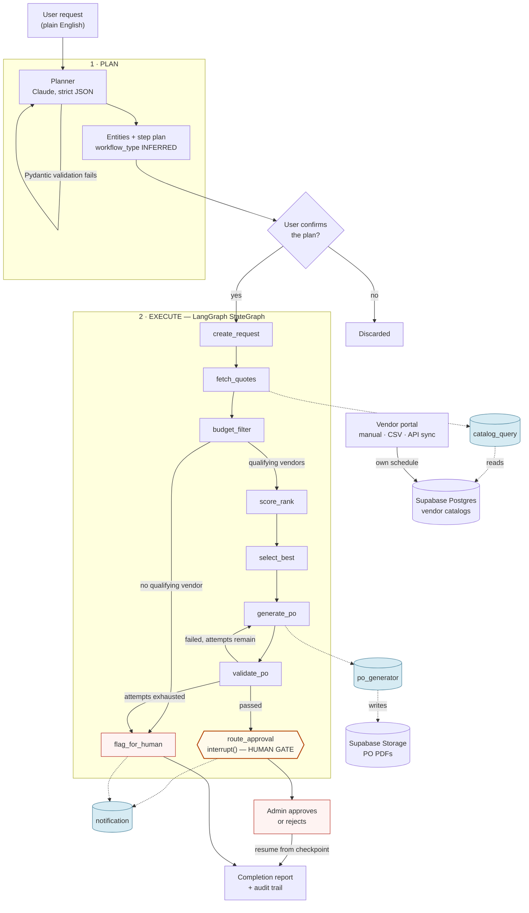

# AgentFlow

Agentic AI for autonomous business workflow execution.

A user types a plain-English business request. An agent parses it, publishes a
visible execution plan, executes each step, makes a transparent scored
decision, validates its own output, self-corrects on failure, pauses at a
mandatory human approval gate, and produces a plain-language report.

```
"Create a purchase request for 50 laptops under PKR 10 million, compare three
 suppliers, identify the best option, prepare the purchase order, and send it
 for approval."
```

---

## Architecture



**The vendor portal writes to the database on its own schedule. The agent only
ever reads.** No outbound HTTP happens inside a run, which is what keeps
execution fast, deterministic and replayable.

---

## What is built

### Backend — Python 3.12, FastAPI, LangGraph, Supabase

| Area | State |
|---|---|
| 23-table schema + 43 RLS policies | applied to Supabase |
| LangGraph orchestrator, 8 nodes | runs end to end |
| Scoring MODE A (single item) | 27 tests, reproduces screen 5a |
| Scoring MODE B (multi item) | reproduces screen 11a incl. split scenarios |
| Code-based validator | 5 checks, self-correction, escalation |
| Tool registry (3 tools) | retry + backoff, every call logged |
| Workflow templates (2 types) | YAML; adding a type touches no Python |
| REST + WebSocket API | 41 operations, OpenAPI at `/docs` |
| Planner (Claude) | live; infers workflow type from text alone |
| Reimbursement workflow | runs end to end; policy engine excludes over-cap lines |

### Flutter app — Android-first, iOS-compatible

| Area | State |
|---|---|
| Design tokens from `AgentFlow.dc.html` | extracted by frequency analysis |
| Liquid glass + claymorphism | both, unnormalised |
| Shared widget library | 25 widgets, all screens compose them |
| Typed API client | 40 methods, contract-tested against live responses |
| Employee flow | home, request, plan, live execution, comparison, validation, PO, report, history, audit, vendors, catalog |
| Admin flow | dashboard, approval queue, approval detail + decision, vendor management |
| Vendor portal | catalog editing, add item, publish, incoming POs |
| Auth | Supabase, ES256 via JWKS |

**Tests: 58 backend, 45 Flutter.**

---

## Running it

### Backend

```bash
cd backend
python -m venv .venv
.venv/Scripts/python -m pip install -r requirements.txt   # Windows
# source .venv/bin/activate && pip install -r requirements.txt   # macOS/Linux

cp .env.example .env      # then fill in the values below

python scripts/apply_migrations.py    # schema + RLS + seed
python scripts/seed_users.py          # demo accounts

python run_local.py                   # http://127.0.0.1:8000/docs
```

`run_local.py` exists because psycopg's async mode cannot run on Windows'
default ProactorEventLoop, and uvicorn reinstalls that policy during its own
startup. On Linux, `uvicorn app.main:app` works directly.

### Flutter

```bash
cd app
flutter pub get
flutter run --dart-define=API_BASE_URL=http://10.0.2.2:8000   # Android emulator
```

`10.0.2.2` is the emulator's alias for the host. A physical phone needs a real
URL — a tunnel, or the deployed API.

### Demo accounts

Password for all: `AgentFlow!2026`

| Role | Email |
|---|---|
| Employee | `sara@agentflow.demo` |
| Admin | `admin@agentflow.demo` |
| Vendor | `vendor@techsupplies.demo` |

---

## Configuration

Everything tunable lives in `backend/.env`; nothing is hard-coded in business
logic. See `.env.example` for the full list. The ones that matter:

| Key | Notes |
|---|---|
| `DATABASE_URL` | Supabase **session pooler**, port 5432. Transaction mode (6543) breaks LangGraph's checkpointer. Percent-encode `@` in the password. |
| `SUPABASE_SERVICE_ROLE_KEY` | Backend only. Bypasses RLS by design. |
| `ANTHROPIC_API_KEY` | Planner and justification narrator. |
| `ANTHROPIC_WORKSPACE_ID` | Required for identity-linked keys (`sk-ant-api03-…`), which 400 without it. |
| `SCORING_WEIGHT_*` | Defaults; an org row in `scoring_weights` overrides them at runtime. |
| `AGENT_MAX_SELF_CORRECTION_ATTEMPTS` | The `validate_po → generate_po` budget. |

`SUPABASE_JWT_SECRET` is **not** needed: Supabase now signs with asymmetric
keys and the backend verifies via JWKS (ES256), falling back to HS256 only for
a project still on the legacy key.

---

## Extension seams

The brief asked for extension, not a demo. Each of these is one file:

| Change | What you touch |
|---|---|
| Add a tool | one file in `app/agent/tools/`, one `register()` line |
| Add a workflow type | one YAML in `app/agent/templates/` |
| Add a scoring strategy | one class implementing `ScoringStrategy` |
| Add a catalog source | one class implementing `CatalogSource` |
| Change weights / retries / thresholds | env or an admin API call |

`reimbursement.yaml` is the proof: a different domain with policy-compliance
logic rather than ranking, compiled by the same engine, reusing the same human
gate and the same PO/notification tools. No engine change.

---

## Design fidelity

Tokens were extracted from `AgentFlow.dc.html` by frequency analysis rather
than eyeballed. `app/test/goldens/` holds rendered screens driven by **real
captured API responses**, so they show what a user actually sees.

Three places where the design and reality disagreed, and what was done:

1. **Screen 5a's score bars are not self-consistent.** Metro's warranty
   segment is wider than TechSupplies' despite half the warranty. No monotonic
   formula produces that, so the bar widths are treated as illustrative and
   the segments are computed from the real weighted contributions. Ranking and
   totals match; segment widths do not.

2. **14a and 14d are the same screen in two treatments.** Both are
   implemented; the vendor portal has a runtime toggle, defaulting to clay.

3. **The design contradicts itself on stock.** 14a shows the docking kit at 12
   with a "Low stock" badge; 11a has TechSupplies supplying 60 of them. The
   seed gives TechSupplies a fourth genuinely low-stock item so both screens
   are correct. See `migrations/005_seed_lowstock.sql`.

### Verified live

The planner infers `workflow_type` from the text alone, with no client hint:

| Request | Inferred | Plan |
|---|---|---|
| "50 laptops under PKR 10 million, compare three suppliers…" | `procurement` | 8 steps |
| "50 laptops, 20 CPU kits, 60 docking kits under PKR 12 million" | `procurement` | 8 steps |
| "claim back PKR 85,000 for my Karachi client visit…" | `reimbursement` | **6 steps** |
| "We're out of monitors again. Grab 25 of the 27-inch ones, keep it under two million rupees, and route it to Imran" | `procurement` | 8 steps, approver `Imran` |

A full procurement run: 8 steps, TechSupplies selected at PKR 8,700,000, 5/5
validation checks passed, employee refused (403) at the approval gate, admin
approved, a double-tap returned `resumed: false`, workflow `completed`.

A reimbursement run: hotel PKR 45,000 and flights PKR 32,000 pass their caps,
meals PKR 8,000 is **excluded** against the PKR 6,000 daily cap, payable PKR
77,000 — through the same engine, with no Python change beyond one node
handler.

---

## Not finished

Stated plainly rather than implied:

- **Not deployed.** Runs locally against the live Supabase project.
- **CSV import** — schema, adapter interface and endpoints exist; the
  column-mapping and preview UI does not.
- **Push, deep links** — `fcm_tokens` and the notification tool exist; Firebase
  is not wired into the app.
- **Reimbursement UI** — the workflow runs end to end and displays through the
  generic screens; a dedicated policy-check results screen mirroring 6a is not
  built.
- **Latency.** The Supabase project is in Tokyo: ~214 ms per query, so a full
  run takes ~73 s, dominated by round trips rather than compute. Deploying to
  the same region largely resolves it.

---

## Repository

```
backend/
  app/
    agent/           planner, orchestrator, tools, scoring, validation, templates
    api/             routers + WebSocket
    db/              SQLAlchemy models, session
    repositories/    all database access
    schemas/         Pydantic contracts
    services/        workflow lifecycle, catalog sources
  migrations/        DDL, RLS, seed
  scripts/           migrations, users, demo run
app/
  lib/
    api/             typed client + models
    screens/         employee, admin, vendor, auth
    state/           Riverpod providers, live WebSocket
    theme/           tokens, surfaces, ThemeData
    widgets/         shared library
  test/
    fixtures/        real API responses
    goldens/         rendered screens
```
